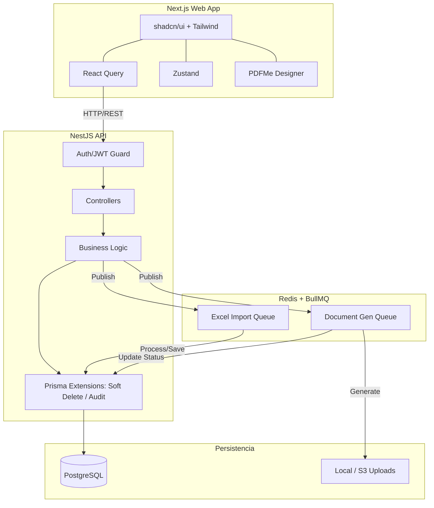

# 🏛️ Arquitectura Técnica Enterprise - Sistema PPP (SaaS)

Este documento detalla el diseño arquitectónico del sistema de Prácticas Preprofesionales (PPP), asegurando escalabilidad, mantenibilidad y rendimiento óptimo bajo un modelo multi-tenant.

## 1. Visión General de la Arquitectura

### 1.1 Explicación y Responsabilidades
El sistema operará bajo una arquitectura de micro-servicios lógicos centralizados en un **Monorepo** (Turborepo). Esta decisión permite compartir tipos, configuraciones y utilidades entre el Frontend y el Backend sin fricción, garantizando una fuente única de la verdad.

- **Capa Frontend (Next.js App Router)**: Responsable exclusiva de la presentación, la experiencia de usuario (UX) y la interacción. Mantiene un estado sincronizado con el servidor usando **React Query** y maneja el estado local complejo (ej. multi-paso, menús) con **Zustand**.
- **Capa Backend (NestJS)**: Actúa como el cerebro del sistema. Valida las reglas de negocio, procesa tareas pesadas en segundo plano (colas) y expone una API RESTful segura.
- **Capa de Persistencia (PostgreSQL + Redis)**: PostgreSQL sirve como el almacenamiento primario relacional (usando **Prisma**), mientras que Redis gestiona las colas de trabajo y el almacenamiento en caché rápido de sesiones.

### 1.2 Capas y Dependencias (Clean Architecture en NestJS)
El backend se estructura mediante **Clean Architecture Modular**:
1. **Controladores (Controllers)**: Capa de transporte. Reciben las peticiones HTTP, validan los *DTOs* (Data Transfer Objects) mediante `class-validator` y delegan la ejecución. No contienen lógica de negocio.
2. **Servicios (Application Services)**: Contienen los Casos de Uso. Orquestan llamadas a repositorios, emiten eventos y procesan lógicas como "Validar si un estudiante puede iniciar la práctica".
3. **Repositorios (Infrastructure)**: Capa de Prisma. Aisla la lógica de base de datos.
4. **Dependencias y Comunicación**: El flujo es estrictamente unidireccional (Controller -> Service -> Infra). Las colas asíncronas se manejan delegando a **BullMQ** (ej. subida de Excel y delegación del parseo).

---

## 2. Diagramas Arquitectónicos

### 2.1 Flujo General y Ecosistema


### 2.2 Arquitectura Monorepo (Estructura de Carpetas)
```text
ppp-monorepo/
├── apps/
│   ├── web/                     # Next.js App
│   │   ├── src/app/             # Next.js App Router (Pages, Layouts)
│   │   ├── src/components/      # UI (shadcn), Shared, y Features
│   │   ├── src/lib/             # Zustand, axios, utils
│   │   └── src/hooks/           # React Query custom hooks
│   └── api/                     # NestJS App
│       ├── src/modules/         # Módulos de Clean Architecture
│       ├── src/common/          # Guards, Interceptors, Filters
│       └── src/queues/          # BullMQ Consumers / Processors
├── packages/
│   ├── db/                      # Prisma schema, migrations, y seeds
│   ├── config/                  # Eslint, Prettier, Tailwind presets
│   └── types/                   # Interfaces compartidas (Zod schemas)
├── docker-compose.yml           # Setup de PostgreSQL, Redis
└── turbo.json                   # Configuración del pipeline Turborepo
```

---

## 3. Estrategias Técnicas Obligatorias

### 3.1 Estrategia Prisma (Persistencia Centralizada)
Todo el esquema residirá en `packages/db`. Se generará el cliente exportándolo para ser consumido por NestJS. Se habilitarán **Prisma Client Extensions** globalmente en la inicialización del módulo de base de datos. No existirá lógica SQL directa ("raw") a menos que sea estrictamente necesario para reportes muy complejos.

### 3.2 Estrategia Multi-Tenancy (Row-Level Security / Lógico)
- **Implementación**: Multi-tenancy lógico. Todas las tablas principales tendrán una columna `faculty_id`.
- **Aislamiento**: En NestJS, se usará `nestjs-cls` (AsyncLocalStorage) para capturar el `faculty_id` desde el JWT del usuario autenticado en cada petición.
- **Seguridad**: Una Extensión de Prisma inyectará automáticamente `WHERE faculty_id = X` en todas las consultas (find, update, delete) para prevenir fuga de datos inter-facultades por error humano.

### 3.3 Estrategia Soft Delete y Audit Logs
- **Soft Delete**: Los registros nunca se eliminarán con `DELETE`. Prisma Extension interceptará los métodos `delete` y `deleteMany` para convertirlos en `update({ deletedAt: new Date() })`, y altera `findMany`/`findFirst` agregando `deletedAt: null`.
- **Audit Logs**: Otra Prisma Extension (o un Interceptor) atrapará toda mutación (`create`, `update`, `delete`). Transformará el evento insertando asíncronamente en la tabla `audit_logs` la información: `user_id`, `action_type`, `table_name`, `record_id`, `old_data`, y `new_data`.

### 3.4 Estrategia de Autenticación (JWT Auth)
- **Cero Sesiones en Estado**: Auth puramente sin estado usando **JWT (JSON Web Tokens)**.
- **Access y Refresh Tokens**: El `Access Token` (vida corta: 15 min) se usará para peticiones a la API. El `Refresh Token` (vida larga: 7 días, almacenado en BD y en HttpOnly Cookie) permitirá la renovación automática silenciosa vía un interceptor de Axios en el Frontend.
- **Roles y Guards**: Guardias de NestJS (`@Roles('ADMIN', 'COORDINATOR')`) validarán la autorización a nivel de endpoint.

### 3.5 Estrategia DTO y Validaciones
- **Backend (NestJS)**: Clases con `@nestjs/swagger` y `class-validator` asegurando el contrato. Rechazo automático de payloads inválidos.
- **Frontend (Next.js)**: Validación en tiempo real usando **Zod**. En el mejor de los casos, los esquemas de Zod se ubicarán en `packages/types` para ser la fuente de verdad tanto para formularios frontend como validaciones si se requiere compartir.

### 3.6 Estrategia de Colas (BullMQ) y Uploads
- **Uploads Temporales**: Archivos subidos vía `react-dropzone` van a un controlador de NestJS (Multer) que los guarda en una carpeta `uploads/tmp` o en un bucket.
- **Queues Asíncronas**: La API recibe el archivo Excel, genera un job en Redis vía **BullMQ** y responde "202 Accepted".
- **Workers**: Los consumidores de BullMQ (en NestJS) procesan los registros por lotes (batch inserts en Prisma) y notifican el estado. Esto previene que una importación de 5,000 alumnos bloquee el hilo principal de Node.

### 3.7 Estrategias Documentales (PDFMe y Docxtemplater)
- **Word (Docxtemplater)**: Usado para documentos narrativos complejos (ej. Solicitudes al Decano). El backend inyecta los metadatos (nombre, empresa) en el archivo `.docx` base y lo convierte en el documento de salida.
- **PDF (PDFMe + React Konva)**:
  - **Visual Designer (Frontend)**: El coordinador usa `pdfme/ui` embebido para diseñar certificados visualmente. La definición del diseño se guarda en BD como un JSON de plantilla.
  - **Generator (Backend)**: Cuando finalizan las prácticas masivamente, BullMQ usa `pdfme/generator` junto con la plantilla guardada y la data de los estudiantes para estampar los PDF finales.
  - *React Konva* se usará de ser necesario para renderizados interactivos especiales (firmas arrastrables) que requieran manipulación de canvas customizada.

### 3.8 Estrategias de Estado Frontend (Zustand + React Query)
- **TanStack Query (React Query)**: **Único** responsable de la comunicación con NestJS. Cachea listados (ej. `useQuery(['students', facultyId])`), maneja estados de loading/error y mutaciones optimistas para tablas rápidas.
- **Zustand**: **Único** responsable del estado global *síncrono*. Administra el `sessionStore` (datos del usuario logueado), control de interfaz (sidebar abierto/cerrado) y flujos modales.

---

## 4. Convenciones de Desarrollo

1. **Nomenclatura**:
   - `kebab-case` para archivos y carpetas (`create-student.dto.ts`, `auth.controller.ts`).
   - `PascalCase` para Componentes de React, Clases, e Interfaces.
   - `camelCase` para variables y funciones.
2. **Estrictez TypeScript**:
   - `strict: true`, `noImplicitAny: true`. Total prohibición de `any`. Uso de genéricos y `unknown`.
3. **Manejo Centralizado de Errores**:
   - NestJS usará un `GlobalExceptionFilter` que traduce Prisma Errors o errores de dominio en respuestas JSON estandarizadas `{ statusCode, message, error }`. En Next.js, Axios interceptors atraparán los *401* para renovar tokens o redirigir al login.
4. **DRY (Don't Repeat Yourself)**:
   - Componentes UI modulares (shadcn). No escribir dos veces el mismo botón o hook de red.

---

## 5. Roadmap Técnico por Fases

- **Fase 1: Infraestructura y Setup Core (Semanas 1-2)**
  - Setup Turborepo (Next.js, NestJS, Prisma, ESLint).
  - Configuración Docker Compose (PostgreSQL, Redis).
  - Esquema Prisma base, Extensions (Soft delete, Multi-tenant) y Auth/JWT JWT Guard.
  
- **Fase 2: Módulos Maestros y Usuarios (Semanas 3-4)**
  - CRUD de Facultades, Programas y Usuarios (RBAC Admin/Coordinators).
  - Implementación base en UI (Layouts, Sidebar, Zustand Auth, Data Tables con TanStack Table).

- **Fase 3: Gestión de Prácticas e Importación Masiva (Semanas 5-6)**
  - Módulos de Estudiantes, Empresas y Prácticas.
  - Integración BullMQ y ExcelJS.
  - UI: react-dropzone, progress bars para jobs asíncronos.

- **Fase 4: Motor de Generación Documental (Semanas 7-8)**
  - Sistema de plantillas de Word (Docxtemplater) para Solicitudes.
  - Integración del Diseñador Visual de PDF (PDFMe) para Coordinadores.
  - Queues de generación masiva y guardado de `generated_documents`.

- **Fase 5: Reportes, Auditoría y Despliegue (Semanas 9-10)**
  - Visor de `audit_logs`.
  - Exportación de métricas y estadísticas.
  - Refinamiento de UI/Framer Motion animations.
  - Preparación para producción y documentación final.
